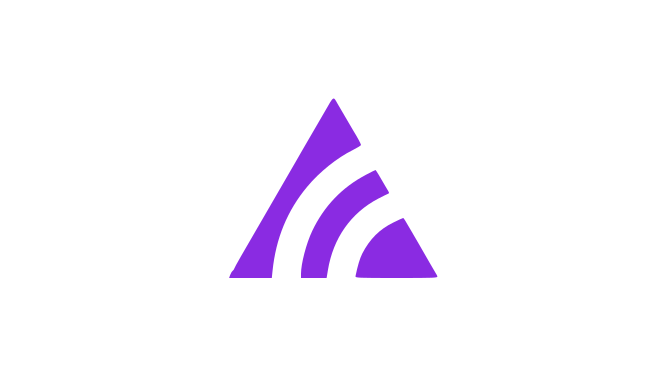
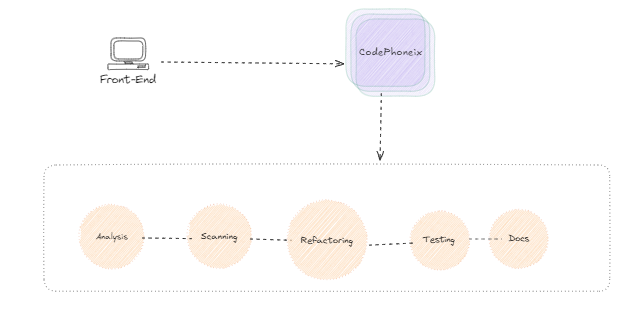

# CodePhoenix

<p align="center">
  
  <br>
  <i>Code Phoenix : Hackaton Code Rebirth 2024</i>
</p>

# Guida all'Installazione e Avvio dell'Applicazione

## Indice

- [Guida all'Installazione e Avvio dell'Applicazione](#guida-allinstallazione-e-avvio-dellapplicazione)
  - [Prerequisiti](#prerequisiti)
  - [Opzione 1: Installazione Diretta](#opzione-1-installazione-diretta)
  - [Opzione 2: Installazione con Docker](#opzione-2-installazione-con-docker)
  - [Accesso all'Applicazione](#accesso-allapplicazione)
- [Architettura dell'applicazione](#architettura-dellapplicazione)
- [Sequence Diagram](#sequence-diagram)
- [Documentazione Aggiuntiva](#documentazione-aggiuntiva)

## Prerequisiti

1. Un account Together AI
2. Python 3.12 o superiore
3. Node.js e npm
4. Java Development Kit (JDK) 17 o superiore

Oppure Docker e Docker Compose [per l'installazione con Docker](#opzione-2-installazione-con-docker)

## Opzione 1: Installazione Diretta

### 1. Preparazione dell'Ambiente

1. Installa Python 3.12 o superiore dal [sito ufficiale di Python](https://www.python.org/downloads/)
2. Installa Node.js e npm dal [sito ufficiale di Node.js](https://nodejs.org/)
3. Installa JDK 17 o superiore dal [sito ufficiale di Oracle](https://www.oracle.com/java/technologies/javase-jdk11-downloads.html) o usando OpenJDK

### 2. Configurazione del Backend

1. Clona il repository del progetto
2. Naviga nella directory principale del progetto
3. Crea un ambiente virtuale Python:

   ```
   python -m venv venv
   source venv/bin/activate  # Per Linux/macOS
   venv\Scripts\activate  # Per Windows
   ```

4. Installa le dipendenze del backend:

   ```
   pip install -r requirements.txt
   ```

5. Scarica e installa SonarScanner:
   - Visita la [pagina di download di SonarScanner](https://docs.sonarqube.org/latest/analysis/scan/sonarscanner/)
   - Scarica la versione appropriata per il tuo sistema operativo
   - Estrai l'archivio e aggiungi la directory `bin` al tuo PATH di sistema

### 3. Configurazione del Frontend

1. Naviga nella directory tramite `cd ./frontend_react`
2. Installa le dipendenze del frontend:

   ```
   npm install
   ```

### 4. Generare la chiave API di Together AI

1. Accedi al tuo account [Together AI](https://www.together.ai/) o creane uno nuovo
2. Vai alla sezione delle impostazioni del tuo account
3. Cerca l'opzione per generare una nuova chiave API
4. Copia la chiave API generata

Questo verrà usato per fare inferenza con modelli open source, alternativamente usabili anche in locale.

### 5. Configurazione di SonarQube

1. Scarica SonarQube Community Edition dal [sito ufficiale](https://www.sonarqube.org/downloads/)
2. Estrai l'archivio in una directory di tua scelta
3. Avvia SonarQube eseguendo lo script appropriato nella directory `bin` dell'installazione di SonarQube:
   - Per Linux/macOS: `./sonar.sh start`
   - Per Windows: `StartSonar.bat`

Dopo aver avviato l'applicazione e aver visto nel terminale il messaggio `SonarQube is operational`, segui questi passaggi per configurare SonarQube:

1. Apri il browser e vai su `http://localhost:9000`
2. Accedi con le credenziali predefinite:
   - Username: `admin`
   - Password: `admin`
3. Segui le istruzioni per cambiare la password al primo accesso
4. Crea un nuovo progetto locale chiamato "project", usando le "global settings"
5. Vai nelle opzione "Locally"
6. Genera un token per questo progetto per l'analisi locale
7. Copia il token generato
8. Apri il file `.env` nella directory principale del progetto
9. Aggiungi la seguente riga, sostituendo `<TUO_TOKEN_SONARQUBE>` con il token copiato:

   ```
   SONARQUBE_TOKEN=<TUO_TOKEN_SONARQUBE>
   ```

9. Salva e chiudi il file `.env`

### 7. Avvio dell'Applicazione

1. Avvia il backend:

   ```
   uvicorn app:app --host 0.0.0.0 --port 60000
   ```

2. In un nuovo terminale, avvia il frontend:

   ```
   cd frontend_react
   npm run dev
   ```

## Accesso all'Applicazione

Dopo aver configurato SonarQube e riavviato l'applicazione, puoi accedere al frontend dell'applicazione navigando nel tuo browser web a:

```bash
http://localhost:3000
```

## Opzione 2: Installazione con Docker

### 1. Installare Docker

Se non hai già Docker installato sul tuo sistema, segui questi passaggi:

1. Visita il [sito ufficiale di Docker](https://www.docker.com/get-started)
2. Scarica e installa Docker Desktop per il tuo sistema operativo (Windows, macOS, o Linux)
3. Segui le istruzioni di installazione fornite per il tuo sistema operativo

### 2. Costruire l'Immagine Docker

Nella directory principale del progetto, esegui il seguente comando per costruire l'immagine Docker:

```bash
docker compose build
```

Questo comando costruirà tutte le immagini Docker necessarie per l'applicazione come specificato nel file `docker-compose.yml`.

### 3. Avviare l'Applicazione

Una volta completata la costruzione dell'immagine, puoi avviare l'applicazione con il seguente comando:

```bash
docker compose up
```

Questo comando avvierà tutti i servizi definiti nel file `docker-compose.yml`.

### 4. Configurazione di SonarQube

Dopo aver avviato l'applicazione e aver visto il messaggio `SonarQube is operational`, segui questi passaggi per configurare SonarQube:

1. Apri il browser e vai su `http://localhost:9000`
2. Accedi con le credenziali predefinite:
   - Username: `admin`
   - Password: `admin`
3. Segui le istruzioni per cambiare la password al primo accesso
4. Crea un nuovo progetto locale chiamato "project", usando le "global settings"
5. Genera un token per questo progetto per l'analisi locale
6. Copia il token generato
7. Apri il file `.env` nella directory principale del progetto
8. Aggiungi la seguente riga, sostituendo `<TUO_TOKEN_SONARQUBE>` con il token copiato:

   ```
   SONARQUBE_TOKEN=<TUO_TOKEN_SONARQUBE>
   ```

9. Salva e chiudi il file `.env`

### 5. Riavvio dell'Applicazione

Dopo aver configurato SonarQube, per applicare le nuove configurazioni, fermare l'applicazione con `Ctrl+C`, poi ricompilarla e riavviarla con il seguente comando:

```bash
docker compose build && docker compose up
```

## Architettura dell'applicazione



## Sequence Diagram


## Documentazione Aggiuntiva

Per ulteriori informazioni guardare la documentazione al link : 

[Documentazione RAD](https://rose-channel-b35.notion.site/Documentazione-11a9a59fb62a80129903e6c9dc33bbf8)

Per ulteriori dettagli sui vari microservizi del progetto, consulta i seguenti documenti:

Ecco la tabella aggiornata con il microservizio di documentazione:

| Microservizio                      | Descrizione                                     | Link alla Documentazione                          |
|------------------------------------|-------------------------------------------------|--------------------------------------------------|
| Sistema di Analisi   🔍  | Analisi del codice                              | [Documentazione Analisi](docs/readme-system_agent_analysis.md) |
| Sistema di Test     💻            | Test automatici e integrazione continua         | [Documentazione Test](docs/readme-system_agent_test.md)       |
| Sistema di Scansione      ⚡       | Scansione di sicurezza e vulnerabilità          | [Documentazione Scansione](docs/readme-system_agent_scanning.md)    |
| Sistema di Refactoring ⚙️          | Refactoring e miglioramento del codice          | [Documentazione Refactoring](docs/readme-system_agent_refactoring.md) |
| Sistema di Documentazione 📚      | Generazione di documentazione per il codice refattorizzato | [Documentazione Documentazione](docs/readme-system_agent_documentation.md) |


### Video Presentazione 

[Link](https://youtu.be/OZQRhPPUV34)

[Link Google Drive](https://drive.google.com/file/d/1bU4CbVPdhbZO6aMgEHKC8T1_lOg5YRbs/view)

### Web Demo 

[Live Demo](https://codephoenix.italynorth.cloudapp.azure.com/)
