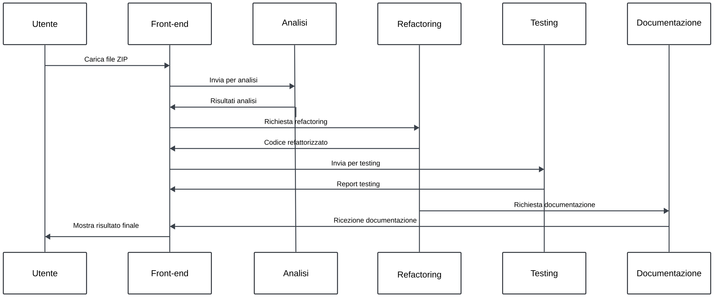

# CodePhoenix

<p align="center">
  
  <br>
  <i>Code Phoenix : Hackaton Code Rebirth 2024</i>
</p>

# Guida all'Installazione e Avvio dell'Applicazione

## Sommario

- [Prerequisiti](#prerequisiti)
- [Passi per l'Installazione](#passi-per-linstallazione)
  - [1. Installare Docker](#1-installare-docker)
  - [2. Generare la Chiave API di Together AI](#2-generare-la-chiave-api-di-together-ai)
  - [3. Configurare il File .env](#3-configurare-il-file-env)
  - [4. Costruire l'Immagine Docker](#4-costruire-limmagine-docker)
  - [5. Avviare l'Applicazione](#5-avviare-lapplicazione)
- [Configurazione di SonarQube](#configurazione-di-sonarqube)
- [Riavvio dell'Applicazione](#riavvio-dellapplicazione)
- [Accesso all'Applicazione](#accesso-allapplicazione)
- [Note Aggiuntive](#note-aggiuntive)
- [Architettura dell'applicazione](#architettura-dellapplicazione)
- [Sequence Diagram](#sequence-diagram)
- [Documentazione Aggiuntiva](#documentazione-aggiuntiva)

## Prerequisiti

1. Docker
2. Docker Compose
3. Un account Together AI

## Passi per l'Installazione

### 1. Installare Docker

Se non hai già Docker installato sul tuo sistema, segui questi passaggi:

1. Visita il [sito ufficiale di Docker](https://www.docker.com/get-started)
2. Scarica e installa Docker Desktop per il tuo sistema operativo (Windows, macOS, o Linux)
3. Segui le istruzioni di installazione fornite per il tuo sistema operativo

### 2. Generare la Chiave API di Together AI

1. Accedi al tuo account [Together AI](https://www.together.ai/) o creane uno nuovo
2. Vai alla sezione delle impostazioni del tuo account
3. Cerca l'opzione per generare una nuova chiave API
4. Copia la chiave API generata

Questo verrà usato per fare inferenza con modelli open source, alternativamente usabili anche in locale.

### 3. Configurare il File .env

1. Nella directory principale del progetto, crea un file chiamato `.env` se non esiste già
2. Apri il file `.env` con un editor di testo
3. Aggiungi la seguente riga, sostituendo `<TUA_CHIAVE_API>` con la chiave API di Together AI che hai copiato:

   ```
   TOGETHERAI_API_KEY=<TUA_CHIAVE_API>
   ```

4. Salva e chiudi il file

### 4. Costruire l'Immagine Docker

Nella directory principale del progetto, esegui il seguente comando per costruire l'immagine Docker:

```bash
docker-compose build
```

Questo comando costruirà tutte le immagini Docker necessarie per l'applicazione come specificato nel file `docker-compose.yml`.

### 5. Avviare l'Applicazione

Una volta completata la costruzione dell'immagine, puoi avviare l'applicazione con il seguente comando:

```bash
docker-compose up
```

Questo comando avvierà tutti i servizi definiti nel file `docker-compose.yml`.

## Configurazione di SonarQube

Dopo aver avviato l'applicazione e aver visto il messaggio `SonarQube is operational`, segui questi passaggi per configurare SonarQube:

1. Apri il browser e vai su `http://localhost:9000`
2. Accedi con le credenziali predefinite:
   - Username: `admin`
   - Password: `admin`
3. Segui le istruzioni per cambiare la password al primo accesso
4. Crea un nuovo progetto locale chiamato "project", usando le "global settings"
5. Genera un token per questo progetto per l'analisi locale
6. Copia il token generato
7. Apri il file `.env` nella directory principale del progetto
8. Aggiungi la seguente riga, sostituendo `<TUO_TOKEN_SONARQUBE>` con il token copiato:

   ```
   SONARQUBE_TOKEN=<TUO_TOKEN_SONARQUBE>
   ```

9. Salva e chiudi il file `.env`

## Riavvio dell'Applicazione

Dopo aver configurato SonarQube, per applicare le nuove configurazioni, fermare l'applicazione con `Ctrl+C`, poi ricompilarla e riavviarla con il seguente comando:

```bash
docker-compose build && docker-compose up
```

## Accesso all'Applicazione

Dopo aver configurato SonarQube e riavviato l'applicazione, puoi accedere al frontend dell'applicazione navigando nel tuo browser web a:

```bash
http://localhost:3000
```

## Architettura dell'applicazione


## Sequence Diagram



## Documentazione Aggiuntiva

Per ulteriori dettagli sui vari microservizi del progetto, consulta i seguenti documenti:

| Microservizio                      | Descrizione                                     | Link alla Documentazione                          |
|------------------------------------|-------------------------------------------------|--------------------------------------------------|
| Sistema di Analisi   🔍  | Analisi del codice                              | [Documentazione Analisi](docs/readme-system_agent_analysis.md) |
| Sistema di Test     💻            | Test automatici e integrazione continua         | [Documentazione Test](docs/readme-system_agent_test.md)       |
| Sistema di Scansione      ⚡       | Scansione di sicurezza e vulnerabilità          | [Documentazione Scansione](docs/readme-system_agent_scanning.md)    |
| Sistema di Refactoring ⚙️          | Refactoring e miglioramento del codice          | [Documentazione Refactoring](docs/readme-system_agent_refactoring.md) |

### Note Aggiuntive

- Per arrestare l'applicazione, premi `Ctrl+C` nel terminale dove hai eseguito `docker compose up`.
- Per eseguire l'applicazione in background, usa il comando `docker compose up -d`.
- Per visualizzare i log dell'applicazione in esecuzione in background, usa `docker compose logs -f`.
