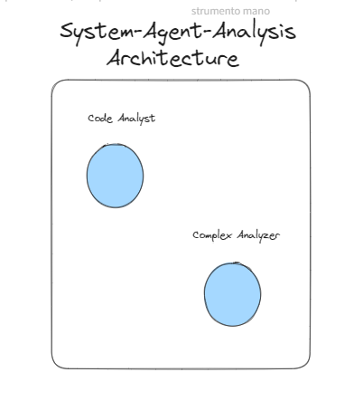
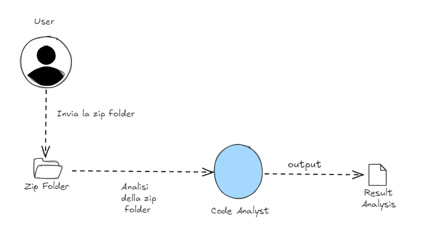
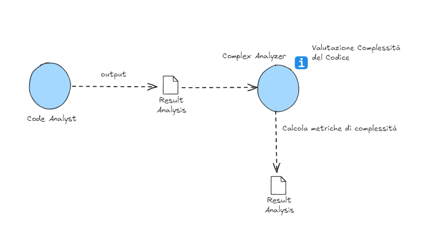

# System-Agent-Anlysis Microservice 🔍

## Descrizione

Il microservizio di Analisi utilizza un sistema multi-agente per analizzare il codice. Esistono due agenti principali che collaborano per eseguire un'analisi approfondita e valutare la complessità del codice.

## Architettura del Microservizio

Il microservizio è progettato per eseguire i task in maniera sequenziale. I task sono assegnati rispettivamente a Code Analyzer e Complex Analyzer, garantendo che l'analisi del codice venga effettuata in due fasi distinte ma complementari.



### Code Analyzer

Questo agente si occupa di analizzare il codice legacy, applicando la sua vasta esperienza per identificare problemi, suggerire miglioramenti e garantire la qualità del codice.

1. **Input**: Riceve il codice legacy da analizzare.
2. **Analisi**: Applica tecniche di analisi statica per identificare problemi nel codice, come bug, vulnerabilità di sicurezza e violazioni delle best practice.
3. **Output**: Fornisce un report dettagliato con i problemi identificati e suggerimenti per miglioramenti.

```python
code_analyst = Agent(
        role='Legacy Code Analyst',
        goal='Analyze and understand legacy code structure and functionality',
        backstory="""You are an experienced developer with decades of experience in analyzing legacy systems.
        Your expertise lies in dissecting complex programs and understanding their core logic.""",
        verbose=True,
        allow_delegation=False,
        llm=os.environ["LLM"],
    )
```

#### WorkFlow - Code Analyzer



### Complex Analyzer

Questo agente valuta la complessità del codice, fornendo metriche dettagliate che aiutano a comprendere meglio le aree più critiche e complesse del progetto.

1. **Input**: Riceve il codice da analizzare insieme al report prodotto dal Code Analyzer.
2. **Valutazione della Complessità**: Calcola varie metriche di complessità, come la complessità ciclomatica, la profondità dei blocchi nidificati e il numero di linee di codice.
3. **Output**: Fornisce un report con le metriche di complessità e suggerisce aree del codice che potrebbero beneficiare di un refactoring per ridurre la complessità.

```python
    complexity_assessor = Agent(
        role='Code Complexity Assessor',
        goal='Evaluate the overall complexity of the legacy codebase',
        backstory="""You are an expert in software metrics and complexity analysis.
        You specialize in assessing code complexity across different languages and providing actionable insights.""",
        verbose=True,
        allow_delegation=False,
        llm=os.environ["LLM"],
    )
```

#### WorkFlow - Code Analyzer



### Parametri - Code Analyzer & Complex Analyzer

- **role** : Descrive il ruolo che l'agente deve avere all'interno
- **goal** : Descrive l'obiettivo che l'agente deve raggiungere all'interno del microservizio
- **backstory** : Riguarda l'aspetto del **prompt engineering** utilizzato per poter dare attributi in più agli agenti
- **allow_delegation** : permette agli altri agenti che fanno parte di una **Crew** di poter scambiare gli output tra di loro.
- **LLM**: rappresenta il core del tipo di Large Language Model che abbiamo utilizzato

### Task - Code Analyzer

```python
task1 = Task(
    description=f"""Analyze the structure and functionality of the legacy code.
    Identify key modules, data structures, and business logic implementations.
    Code: {code}""",
    expected_output="Detailed report on code structure and functionality",
    agent=code_analyst,
)
```

#### Parametri - Task

- **description**: Descrive il compito che deve essere eseguito.
  - Esempio: "Analyze the structure and functionality of the legacy code. Identify key modules, data structures, and business logic implementations. Code: {code}"
- **expected_output**: Descrive l'output atteso dopo l'esecuzione del task.
  - Esempio: "Detailed report on code structure and functionality"
- **agent**: L'agente responsabile dell'esecuzione del task.
  - Esempio: `code_analyst`

### Task - Evaluation Analyzer

```python
task2 = Task(
    description=f"""Using the insights from the code analysis, assess the overall complexity of the legacy codebase.
    Provide metrics and recommendations for refactoring priorities.
    Code: {code}""",
    expected_output="Comprehensive complexity assessment report with refactoring suggestions" if not number_response else "A single digit number, from 0 to 9 inclusive, indicating the complexity of the code.",
    agent=complexity_assessor
)
```

#### Parametri - Task

- **description**: Descrive il compito che deve essere eseguito.
  - Esempio: "Using the insights from the code analysis, assess the overall complexity of the legacy codebase. Provide metrics and recommendations for refactoring priorities. Code: {code}"
- **expected_output**: Descrive l'output atteso dopo l'esecuzione del task.
  - Esempio: "Comprehensive complexity assessment report with refactoring suggestions" if not number_response else "A single digit number, from 0 to 9 inclusive, indicating the complexity of the code."
- **agent**: L'agente responsabile dell'esecuzione del task.
  - Esempio: `complexity_assessor`

#### Crew - System Agent Analysis

La **crew** risulta essere l'insieme degli agenti che vengono creati e a cui vengono assegnati i task :

```python
    # Instantiate the crew for legacy code analysis
    analysis_crew = Crew(
        agents=[code_analyst, complexity_assessor],
        tasks=[task1, task2],
        verbose=True,
        process=Process.sequential
    )

    # Execute the analysis
    analysis_result = analysis_crew.kickoff()
```

#### Parametri - Crew

- **agents**: L'insieme di agenti che vengono creati per eseguire il compito
- **tasks**: L'insieme dei vari task che sono stati assegnati ai vari agenti.
- **process**: Indica se il tipo di processo può essere sequenziale oppure no
