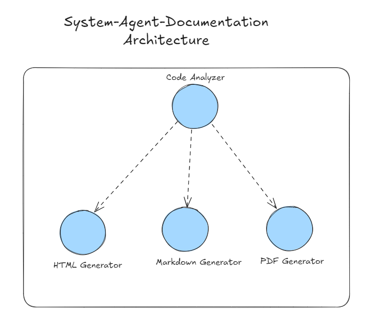

# Documentation Microservice 📋

## Descrizione

Il microservizio di Analisi utilizza un sistema multi-agente per analizzare il codice e generare documentazione. Sono disponibili quattro agenti principali, ognuno specializzato in un aspetto specifico dell'analisi e della documentazione del codice refattorizzato. Ogni agente è associato a task specifiche che definiscono chiaramente le operazioni da eseguire.

## Architettura del Microservizio

Il microservizio è progettato per eseguire i task in modo sequenziale. Ogni agente è responsabile di un compito specifico, garantendo un processo di analisi e documentazione completo e dettagliato.



### Code Analyzer

Questo agente si occupa di analizzare il codice refattorizzato, applicando la sua esperienza per identificare la struttura e la funzionalità del codice.

1. **Input**: Riceve il codice refattorizzato da analizzare.
2. **Analisi**: Utilizza strumenti di analisi per identificare problemi e miglioramenti nella struttura del codice.
3. **Output**: Fornisce un report dettagliato sulla struttura e funzionalità del codice.

```python
def create_code_analyzer_agent():
    role_agent = "Senior Code Analyzer"
    goal_agent = "Analyze and understand code structure and functionality"
    backstory = """You are an experienced developer with decades of experience in analyzing and refactoring systems.
    Your expertise lies in dissecting complex programs and understanding their core logic."""
    
    llm = os.environ["LLM"]

    return Agent(
        role=role_agent,
        goal=goal_agent,
        tools=[
            CodeInterpreterTool(),
            DirectoryReadTool(),
            FileReadTool(),
            CodeDocsSearchTool(),
            SerperDevTool(),
        ],
        backstory=backstory,
        llm=llm,
        verbose=True
    )
```

#### Create Analyze Code Task

Questo task crea una richiesta per l'agente di analizzare il codice refattorizzato.

```python
def create_analyze_code_task(agent, code_refactoring_result):
    return Task(
        description=f'Perform a comprehensive analysis of the refactored code, including the following improvements and issues: {code_refactoring_result}. Identify potential issues and adherence to best practices across multiple programming languages.',
        expected_output='A detailed report outlining the analysis of the refactored code, including identified issues, areas of improvement, and adherence to coding standards.',
        agent=agent,
    )
```

### PDF Document Generator Agent

Questo agente genera documentazione in formato PDF analizzando il codice refattorizzato e producendo documenti professionali e dettagliati.

1. **Input**: Riceve il report dal Code Analyzer e il codice refattorizzato.
2. **Generazione PDF**: Crea un documento PDF chiaro e conciso basato sull'analisi del codice.
3. **Output**: Fornisce un documento PDF ben strutturato contenente la documentazione del codice.

```python
def create_pdf_documenter_agent():
    role_agent = "Senior Expert Coding Documentation PDF Maker"
    role_goal = "Analyze the refactored code and generate comprehensive PDF documentation."
    
    backstory = """You are a senior documentation expert with extensive experience in creating detailed and professional PDF documents. 
    Your expertise lies in analyzing complex codebases, understanding the refactoring process, and presenting the information clearly and concisely in a PDF format."""

    llm = os.environ["LLM"]

    return Agent(
        role=role_agent,
        goal=role_goal,
        tools=[
            DirectoryReadTool(),
            FileWriterTool(),
            FileReadTool(),
            SerperDevTool(),
            pdf_generator_tool,
        ],
        backstory=backstory,
        llm=llm,
        verbose=True
    )
```

#### Create PDF Documentation Task

Questo task crea una richiesta per l'agente di generare documentazione in formato PDF.

```python
def create_generate_pdf_task(agent, code_refactoring_result):
    return Task(
        description=f'Generate comprehensive PDF documentation based on the code analysis report, which includes details on the refactored code: {code_refactoring_result}. Ensure the documentation is well-structured and includes all necessary details.',
        expected_output='A well-structured PDF document containing detailed documentation of the code, including analysis results, code snippets, and explanations.',
        agent=agent,
        output_file='docs/project-documentation.pdf'  # Specifica la cartella di output
    )
```

### Markdown Document Generator Agent

Questo agente genera documentazione in formato Markdown, consentendo una lettura chiara e strutturata.

1. **Input**: Riceve il report dal Code Analyzer e il codice refattorizzato.
2. **Generazione Markdown**: Crea un documento Markdown informativo e ben strutturato.
3. **Output**: Fornisce un file Markdown contenente la documentazione del codice.

```python
def create_markdown_documenter_agent():
    role_agent = "Senior Expert Coding Documentation Markdown Maker"
    role_goal = "Analyze the refactored code and generate detailed Markdown documentation."
    
    backstory = """You are a senior documentation expert specializing in creating clear and readable Markdown documents. 
    You have a deep understanding of code analysis and refactoring processes, allowing you to produce precise and informative Markdown documentation."""

    llm = os.environ["LLM"]

    return Agent(
        role=role_agent,
        goal=role_goal,
        tools=[
            DirectoryReadTool(),
            FileWriterTool(),
            FileReadTool(),
            SerperDevTool(),
            markdown_generator_tool,
        ],
        backstory=backstory,
        llm=llm,
        verbose=True
    )
```

#### Create Markdown Documentation Task

Questo task crea una richiesta per l'agente di generare documentazione in formato Markdown.

```python
def create_generate_markdown_task(agent, code_refactoring_result):
    return Task(
        description=f'Generate comprehensive Markdown documentation based on the code analysis report, which includes insights on the refactored code: {code_refactoring_result}. Ensure the documentation is well-structured and includes all necessary details.',
        expected_output='A well-structured Markdown document containing detailed documentation of the code, including analysis results, code snippets, and explanations.',
        agent=agent,
        output_file='docs/project-documentation.md'  # Specifica la cartella di output
    )
```

### HTML Document Generator Agent

Questo agente si occupa di generare documentazione in formato HTML, rendendo le informazioni interattive e accessibili.

1. **Input**: Riceve il report dal Code Analyzer e il codice refattorizzato.
2. **Generazione HTML**: Crea un documento HTML dinamico e user-friendly.
3. **Output**: Fornisce un file HTML che presenta la documentazione in modo navigabile e coinvolgente.

```python
def create_html_documenter_agent():
    role_agent = "Senior Expert Coding Documentation HTML Maker"
    role_goal = "Analyze the refactored code and generate interactive HTML documentation."
    
    backstory = """You are a senior documentation expert with a talent for creating dynamic and user-friendly HTML documents. 
    Your skills in analyzing refactored code and presenting it in an engaging HTML format help ensure that documentation is both informative and easy to navigate."""

    llm = os.environ["LLM"]

    return Agent(
        role=role_agent,
        goal=role_goal,
        tools=[
            DirectoryReadTool(),
            FileWriterTool(),
            FileReadTool(),
            SerperDevTool(),
            html_generator_tool,
        ],
        backstory=backstory,
        llm=llm,
        verbose=True
    )
```

#### Create HTML Documentation Task

Questo task crea una richiesta per l'agente di generare documentazione in formato HTML.

```python
def create_generate_html_task(agent, code_refactoring_result):
    return Task(
        description=f'Generate comprehensive HTML documentation based on the code analysis report, which includes details on the refactored code: {code_refactoring_result}. Ensure the documentation is well-structured and includes all necessary details, formatted appropriately for web viewing.',
        expected_output='A well-structured HTML document containing detailed documentation of the code, including analysis results, code snippets, and explanations, formatted for web viewing.',
        agent=agent,
        output_file='docs/project-documentation.html'  # Specifica la cartella di output
    )
```

## Parametri degli Agenti

- **role**: Descrive il ruolo dell'agente all'interno del microservizio.
- **goal**: Descrive l'obiettivo che l'agente deve raggiungere.
- **backstory**: Fornisce un contesto per il prompt engineering, migliorando le capacità degli agenti.
- **tools**: Elenco degli strumenti che l'agente può utilizzare durante il suo lavoro.
- **llm**: Specifica il modello di linguaggio utilizzato.
- **verbose**: Se impostato su True, l'agente fornisce output dettagliati durante l'esecuzione.


## Creazione delle Crew

### Workflow - Documentazione del codice 


### 1. AGENT MARKDOWN CREW

```python
"""
create_markdown_crew(code_refactoring_result, directory_path) - Create a crew to analyze refactored code and generate Markdown documentation.

@:param code_refactoring_result: str - Il risultato del codice refattorizzato da analizzare.
@:param directory_path: str - Il percorso della directory in cui salvare il documento Markdown generato.

@:return: dict - Un messaggio di stato che indica successo o errore, insieme ai risultati della generazione della documentazione.
"""
def create_markdown_crew(code_refactoring_result, directory_path):
    # Crea l'agente di analisi del codice
    agent_code_analyze = create_code_analyzer_agent()

    # Crea l'agente per la generazione di documentazione Markdown
    agent_generation_markdown = create_markdown_documenter_agent()

    task_analyze_code = create_analyze_code_task(agent=agent_code_analyze, code_refactoring_result=code_refactoring_result)
    task_markdown_documenter = create_generate_markdown_task(agent=agent_generation_markdown, code_refactoring_result=code_refactoring_result)

    crew = Crew(
        agents=[task_analyze_code.agent, task_markdown_documenter.agent],
        tasks=[task_analyze_code, task_markdown_documenter],
        verbose=True,
        planning=True,
        memory=True,
        process=Process.sequential
    )

    markdown_result_document = crew.kickoff(inputs={
        'directory_path': directory_path,
        'output_file': 'docs/project-document.md'
    })

    return {
        "status": "success",
        "message": "Markdown documentation generated.",
        "result": markdown_result_document
    }
```

### 2. AGENT PDF CREW

```python
"""
create_pdf_crew(code_refactoring_result, directory_path) - Create a crew to analyze refactored code and generate PDF documentation.

@:param code_refactoring_result: str - Il risultato del codice refattorizzato da analizzare.
@:param directory_path: str - Il percorso della directory in cui salvare il documento PDF generato.

@:return: dict - Un messaggio di stato che indica successo o errore, insieme ai risultati della generazione della documentazione.
"""
def create_pdf_crew(code_refactoring_result, directory_path):
    # Crea l'agente di analisi del codice
    agent_code_analyze = create_code_analyzer_agent()

    # Crea l'agente per la generazione di documentazione PDF
    agent_generation_pdf = create_pdf_documenter_agent()

    task_analyze_code = create_analyze_code_task(agent=agent_code_analyze, code_refactoring_result=code_refactoring_result)
    task_pdf_documenter = create_generate_pdf_task(agent=agent_generation_pdf, code_refactoring_result=code_refactoring_result)

    crew = Crew(
        agents=[task_analyze_code.agent, task_pdf_documenter.agent],
        tasks=[task_analyze_code, task_pdf_documenter],
        verbose=True,
        process=Process.sequential,
    )

    pdf_result = crew.kickoff(inputs={
        'directory_path': directory_path,
        'output_file': 'docs/project-document.pdf'
    })

    return {
        "status": "success",
        "message": "PDF documentation generated.",
        "result": pdf_result
    }
```

### 3. AGENT HTML CREW

```python
"""
create_html_crew(code_refactoring_result, directory_path) - Create a crew to analyze refactored code and generate HTML documentation.

@:param code_refactoring_result: str - Il risultato del codice refattorizzato da analizzare.
@:param directory_path: str - Il percorso della directory in cui salvare il documento HTML generato.

@:return: dict - Un messaggio di stato che indica successo o errore, insieme ai risultati della generazione della documentazione.
"""
def create_html_crew(code_refactoring_result, directory_path):
    # Crea l'agente di analisi del codice
    agent_code_analyze = create_code_analyzer_agent()

    # Crea l'agente per la generazione di documentazione HTML
    agent_generation_html = create_html_documenter_agent()

    task_analyze_code = create_analyze_code_task(agent=agent_code_analyze, code_refactoring_result=code_refactoring_result)
    task_html_documenter = create_generate_html_task(agent=agent_generation_html, code_refactoring_result=code_refactoring_result)

    crew = Crew(
        agents=[task_analyze_code.agent, task_html_documenter.agent],
        tasks=[task_analyze_code, task_html_documenter],
        verbose=True,
        planning=True,
        memory=True,
        process=Process.sequential
    )

    html_documentation_result = crew.kickoff(inputs={
        'directory_path': directory_path,
        'output_file': 'docs/project-document.html'
    })

    return {
        "status": "success",
        "message": "HTML documentation generated.",
        "result": html_documentation_result
    }
```