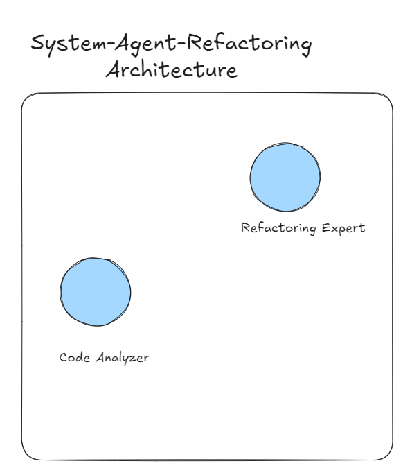
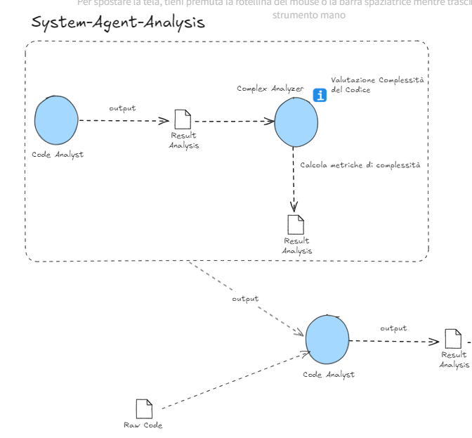
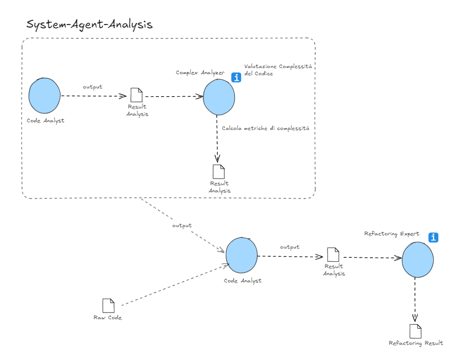

# Refactoring Code Microservice ⚙️

## Descrizione

Il microservizio di Refactoring utilizza un sistema multi-agente per analizzare e migliorare la qualità del codice. Due agenti principali collaborano per eseguire un'analisi approfondita e rifattorizzare il codice, garantendo una migliore struttura, leggibilità e manutenibilità.

## Architettura del Microservizio

Il microservizio è progettato per eseguire i task in maniera sequenziale. I task sono assegnati rispettivamente a Code Analyzer e Refactoring Expert, garantendo che l'analisi del codice venga effettuata in due fasi distinte ma complementari.



### Code Analyzer

Questo agente si occupa di analizzare il codice, applicando la sua vasta esperienza per identificare problemi, suggerire miglioramenti e garantire la qualità del codice.

1. **Input**: Riceve il codice da analizzare.
2. **Analisi**: Applica tecniche di analisi statica per identificare problemi nel codice, come bug, vulnerabilità di sicurezza e violazioni delle best practice.
3. **Output**: Fornisce un report dettagliato con i problemi identificati e suggerimenti per miglioramenti.

```python
code_analyzer = Agent(
    role='Code Analyzer',
    goal='Analyze and understand code structure and functionality',
    backstory="""You are an experienced developer with decades of experience in analyzing and refactoring systems.
    Your expertise lies in dissecting complex programs and understanding their core logic.""",
    verbose=True,
    allow_delegation=False,
    llm=os.environ["LLM"],
)
```

#### WorkFlow - Code Analyzer



### Refactoring Expert

Questo agente rifattorizza il codice, migliorando la sua struttura, leggibilità e manutenibilità, e applicando le best practice del settore.

1. **Input**: Riceve il codice da analizzare insieme al report prodotto dal Code Analyzer.
2. **Refactoring**: Migliora la qualità del codice, riduce la complessità e applica le best practice.
3. **Output**: Fornisce il codice rifattorizzato con spiegazioni delle modifiche apportate.

```python
refactoring_expert = Agent(
    role='Refactoring Expert',
    goal='Refactor the code to improve its structure and readability',
    backstory="""You are an expert in software refactoring techniques.
    You specialize in improving code quality, reducing complexity, and enhancing maintainability.""",
    verbose=True,
    allow_delegation=False,
    llm=os.environ["LLM"],
)
```

#### WorkFlow - Refactoring Expert



### Parametri - Code Analyzer & Refactoring Expert

- **role**: Descrive il ruolo che l'agente deve avere all'interno.
- **goal**: Descrive l'obiettivo che l'agente deve raggiungere all'interno del microservizio.
- **backstory**: Riguarda l'aspetto del **prompt engineering** utilizzato per poter dare attributi in più agli agenti.
- **verbose**: Indica se l'agente deve fornire output dettagliati durante la sua esecuzione.
- **allow_delegation**: Permette agli altri agenti che fanno parte di una **Crew** di poter scambiare gli output tra di loro.
- **llm**: Rappresenta il core del tipo di Large Language Model che abbiamo utilizzato.

### Task - Code Analyzer

```python
task1 = Task(
    description=f"""Analyze the structure and functionality of the given code.
    Identify areas that need improvement in terms of design, efficiency, and readability.
    Code: {code}
    Analysis Result: {analysis_result}""",
    expected_output="Detailed report on code structure and areas for improvement",
    agent=code_analyzer,
)
```

#### Parametri - Task

- **description**: Descrive il compito che deve essere eseguito.
  - Esempio: "Analyze the structure and functionality of the given code. Identify areas that need improvement in terms of design, efficiency, and readability. Code: {code} Analysis Result: {analysis_result}"
- **expected_output**: Descrive l'output atteso dopo l'esecuzione del task.
  - Esempio: "Detailed report on code structure and areas for improvement"
- **agent**: L'agente responsabile dell'esecuzione del task.
  - Esempio: `code_analyzer`

### Task - Refactoring Expert

```python
task2 = Task(
    description=f"""Using the insights from the code analysis, refactor the code to improve its quality.
    Focus on enhancing readability, reducing complexity, and applying best practices.
    Code: {code}
    Analysis Result: {analysis_result}""",
    expected_output="Refactored code with explanations of improvements made",
    agent=refactoring_expert
)
```

#### Parametri - Task

- **description**: Descrive il compito che deve essere eseguito.
  - Esempio: "Using the insights from the code analysis, refactor the code to improve its quality. Focus on enhancing readability, reducing complexity, and applying best practices. Code: {code} Analysis Result: {analysis_result}"
- **expected_output**: Descrive l'output atteso dopo l'esecuzione del task.
  - Esempio: "Refactored code with explanations of improvements made"
- **agent**: L'agente responsabile dell'esecuzione del task.
  - Esempio: `refactoring_expert`

### Crew - System Agent Analysis

La **crew** risulta essere l'insieme degli agenti che vengono creati e a cui vengono assegnati i task.

```python
# Instantiate the crew for code refactoring
refactoring_crew = Crew(
    agents=[code_analyzer, refactoring_expert],
    tasks=[task1, task2],
    verbose=True,
    process=Process.sequential
)

# Execute the refactoring
refactoring_result = refactoring_crew.kickoff()
```

#### Parametri - Crew

- **agents**: L'insieme di agenti che vengono creati per eseguire il compito.
  - Esempio: `[code_analyzer, refactoring_expert]`
- **tasks**: L'insieme dei vari task che sono stati assegnati ai vari agenti.
  - Esempio: `[task1, task2]`
- **process**: Indica se il tipo di processo può essere sequenziale oppure no.
  - Esempio: `Process.sequential`
