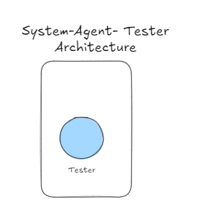
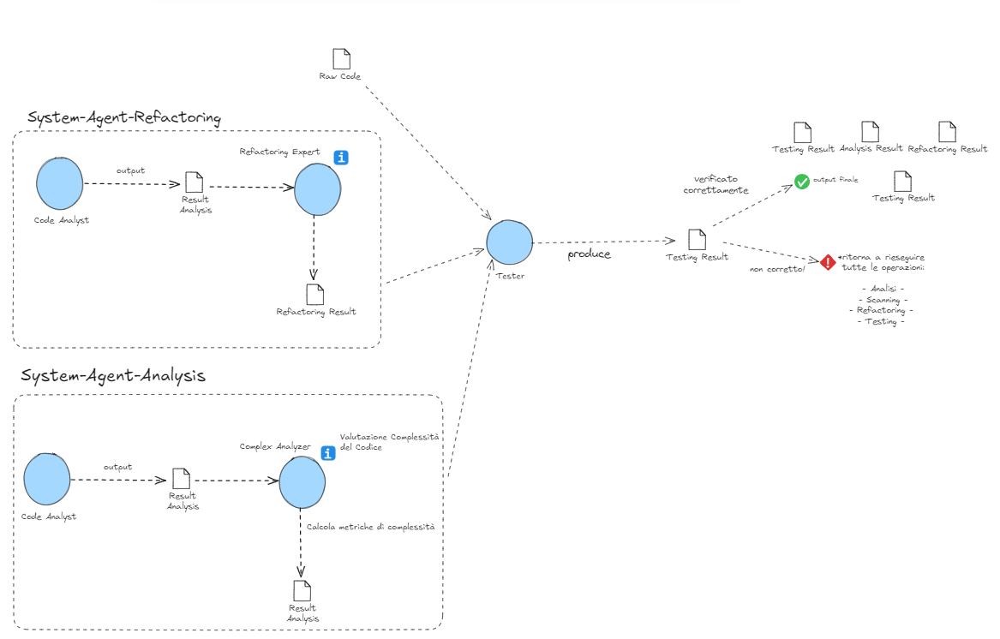

# Testing Code Microservice 💻

## Descrizione

Il microservizio di Testing confronta la funzionalità del codice originale con quella del codice rifattorizzato. Un agente dedicato analizza e verifica che il nuovo codice mantenga la stessa funzionalità del codice originale, garantendo che non ci siano regressioni o cambiamenti non desiderati.

## Architettura del Microservizio

Il microservizio è progettato per eseguire i task di testing in maniera sequenziale. Un agente principale, Code Tester, esegue il compito di confrontare la funzionalità del codice originale con quella del codice rifattorizzato.



### Code Tester

Questo agente si occupa di testare il codice, verificando che il nuovo codice rifattorizzato mantenga la stessa funzionalità del codice originale.

1. **Input**: Riceve il codice originale, il risultato dell'analisi del codice originale e il nuovo codice rifattorizzato.
2. **Testing**: Confronta la funzionalità del codice originale e del codice rifattorizzato per vari input, garantendo che producano gli stessi output.
3. **Output**: Fornisce un report dettagliato sulla equivalenza funzionale o un risultato binario che indica se il nuovo codice ha la stessa funzionalità del codice originale.

```python
code_tester = Agent(
    role='Code Tester',
    goal='Test and compare the functionality of old and new code',
    backstory="""You are an experienced QA engineer with expertise in testing complex systems.
    Your role is to ensure that refactored code maintains the same functionality as the original.""",
    verbose=True,
    allow_delegation=False,
    llm=os.environ["LLM"],
)
```

#### WorkFlow - Code Tester



### Parametri - Code Tester

- **role**: Descrive il ruolo che l'agente deve avere all'interno del microservizio.
- **goal**: Descrive l'obiettivo che l'agente deve raggiungere all'interno del microservizio.
- **backstory**: Riguarda l'aspetto del **prompt engineering** utilizzato per poter dare attributi in più agli agenti.
- **verbose**: Indica se l'agente deve fornire output dettagliati durante la sua esecuzione.
- **allow_delegation**: Permette agli altri agenti che fanno parte di una **Crew** di poter scambiare gli output tra di loro.
- **llm**: Rappresenta il core del tipo di Large Language Model che abbiamo utilizzato.

### Task - Code Tester

```python
task1 = Task(
    description=f"""Compare the functionality of the old and new code.
    Ensure that the refactored code produces the same output as the original code for various inputs.
    I forbid you from fake testing the code, but instead, just analyze the code and say if the refactored code has the same functionality as the original code or not, without any unit testing.
    Old Code: {old_code},
    Old Code Analysis Result: {old_code_analysis_result},
    New Code: {new_code_to_test}""",
    expected_output="Detailed report on functional equivalence and any discrepancies" if not binary_response else "A single binary number, 0 or 1, indicating if the refactored code has DIFFERENT functionality than the original code.",
    agent=code_tester,
)
```

#### Parametri - Task

- **description**: Descrive il compito che deve essere eseguito.
- **expected_output**: Descrive l'output atteso dopo l'esecuzione del task.
- **agent**: L'agente responsabile dell'esecuzione del task.

### Crew - Testing Agent Analysis

La **crew** risulta essere l'insieme degli agenti che vengono creati e a cui vengono assegnati i task.

```python
# Instantiate the crew for testing
testing_crew = Crew(
    agents=[code_tester],
    tasks=[task1],
    verbose=True,
    process=Process.sequential
)

# Execute the testing
test_result = testing_crew.kickoff()
```

#### Parametri - Crew

- **agents**: L'insieme di agenti che vengono creati per eseguire il compito.
  - Esempio: `[code_tester]`
- **tasks**: L'insieme dei vari task che sono stati assegnati ai vari agenti.
  - Esempio: `[task1]`
- **process**: Indica se il tipo di processo può essere sequenziale oppure no.
  - Esempio: `Process.sequential`
